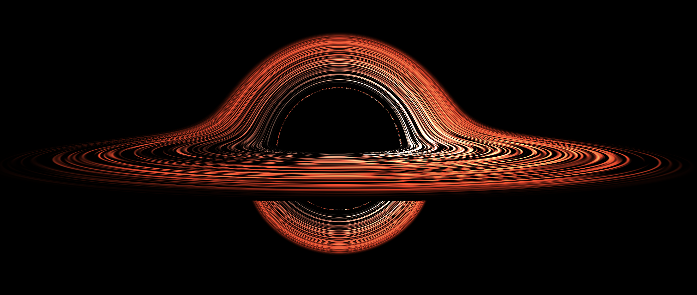

# Black Hole Simulation (Metal 4K Optimized)

A high-performance, real-time Schwarzschild black hole ray tracer written in pure Objective-C++ using Apple Metal. This project implements general relativistic ray marching to simulate the visual appearance of a black hole, including gravitational lensing, an accretion disk with Doppler beaming.    



## Features

*   **Real-time Ray Tracing**: Solves the geodesic equations for photons in curved spacetime to render accurate gravitational lensing.
*   **Accretion Disk**: Volumetric rendering of a relativistic accretion disk with Doppler shifting and beaming effects.
*   **Zero Dependencies**: Written in pure Objective-C++ and Metal, requiring no external libraries (uses standard macOS frameworks).
*   **Interactive Camera**: Switch between an orbital view and a free-flight mode to explore the scene.
*   **Quality Presets**: Adjustable rendering settings (Low to Ultra) to balance performance and visual fidelity.

## Requirements

*   **macOS** (10.15+ recommended)
*   **Metal-compatible GPU** (Apple Silicon M1/M2/M3 highly recommended for 4K performance)
*   **Xcode Command Line Tools** (installed via `xcode-select --install`)

## Build Instructions

1.  Open your terminal and navigate to the project directory:
    ```bash
    cd /path/to/blackhole-sim
    ```

2.  Build the application using `make`:
    ```bash
    make
    ```
    This will compile the `main_4k.mm` file into an executable named `blackhole-sim-metal`.

## How to Run

After building, you can run the simulation explicitly or use the convenience Make target:

**Option 1: Run directly**
```bash
./blackhole-sim-metal
```

**Option 2: Build and Run**
```bash
make run-4k
```

## Controls

| Key / Action | Function |
| :--- | :--- |
| **Mouse Drag** | Rotate the camera (Orbit mode) or Look around (Free mode) |
| **Scroll / Up / Down**| Zoom in / out (Orbit mode) |
| **Z / X** | Zoom In / Out |
| **C** | Toggle Camera Mode (Orbit <-> Free Flight) |
| **F** | Toggle Fullscreen |
| **V** | Cycle Debug Views |
| **1 - 4** | Set Quality Preset (Low, Medium, High, Ultra) |
| **Esc** | Quit Application |

### Free Flight Controls (When in Free Mode)
| Key | Movement |
| :--- | :--- |
| **W / S** | Move Forward / Backward |
| **A / D** | Move Left / Right |
| **Q / E** | Move Down / Up |
| **Shift** | Boost movement speed |

## Technical Implementation Details

*   **Language**: Objective-C++ (`.mm`) mixing C++ logic with Objective-C Metal API calls.
*   **Renderer**: Custom Metal Compute Shader implementing ray marching through the Schwarzschild metric.
*   **Physics**: Photon trajectories are calculated using curved-spacetime geodesics.

## Customization

You can adjust the simulation parameters at the top of `main_4k.mm` in the `SimParams` struct:
*   `diskBoost`: Adjusts the brightness of the accretion disk (currently set to `9.0f`).
*   `rin` / `rout`: Adjusts the inner and outer radius of the accretion disk.
*   `maxSteps`: Adjusts the ray-marching precision (also controlled by Quality presets).